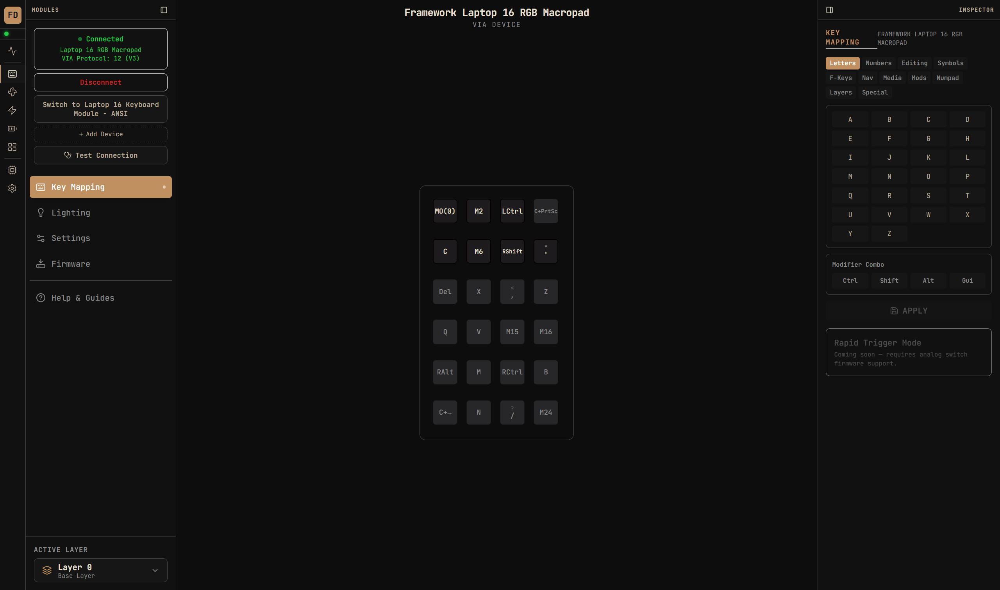
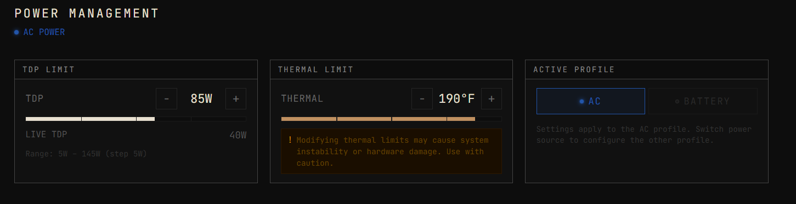
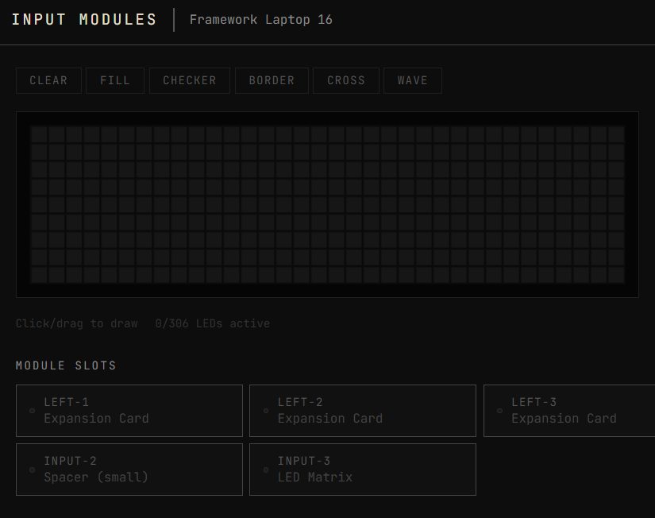
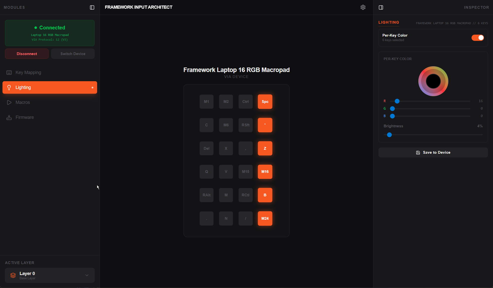

<div align="center">

# FRAMEWORK DECK

**The all-in-one desktop companion for Framework laptops.**

*Oscilloscope telemetry · Keyboard configurator · Fan control · Power management · Battery health · LED Matrix · System info — unified in one industrial-grade interface.*

[](LICENSE)
[](https://tauri.app/)
[](https://react.dev/)
[](https://www.typescriptlang.org/)
[](https://frame.work/)
[](https://developer.mozilla.org/en-US/docs/Web/API/WebHID_API)

</div>

---


*Live oscilloscope dashboard — 10 stacked sensor channels, fan RPM, fan control, power and battery at a glance.*

---

## What is Framework Deck?

Framework Deck is a unified desktop application for Framework laptop owners who want full visibility and control over their hardware. It combines real-time telemetry visualization with the complete keyboard and input module configuration toolset — everything in one window, with a design language inspired by Tektronix oscilloscopes and Teenage Engineering gear.

**Design philosophy:** Precise, industrial, information-dense. JetBrains Mono throughout. CRT scanline overlay. Four color themes. Every reading labeled, every control accessible without hunting through menus.

Built with Tauri 2 + React 19 + TypeScript + Tailwind CSS. Lightweight native window, no Electron, no 200 MB download.

---

## 📦 Includes Input Architect — Framework Input Architect Has Been Merged

> **Framework Input Architect** (`enkode/input-architect`) was a standalone keyboard and macropad configurator for the Framework Laptop 16. After a rapid development cycle (v0.1 → v0.15 in under two weeks), all of its features were absorbed into Framework Deck's **Keyboard** module. The Input Architect repository is now archived and no longer maintained.

**Everything Input Architect could do, Framework Deck does — plus a lot more.**

If you were using Input Architect, just switch to Framework Deck. Your devices connect the same way (WebHID), the VIA protocol support is identical, per-key RGB with nucleardog firmware works exactly the same, and your saved configs will still export/import as JSON.

See the [full Input Architect changelog](#input-architect-history) below for a complete record of what was built before the merge.

---

## Screenshots

### Oscilloscope Dashboard
The main view. Every active sensor on its own color-coded lane, scrolling in real time.


---

### Keyboard Configurator — Key Mapping
Full VIA key remapping on keyboard and macropad. 6 layers, 100+ QMK keycodes, modifier combos, layer switching. Shown here with the Framework 16 RGB Macropad connected via VIA V3.



---

### Keyboard Configurator — Lighting
Global and per-key RGB control. Color picker, brightness, effects, saved config snapshots, and full auto-history. Works with stock firmware (global) and nucleardog firmware (per-key).


---

### Battery Health
State of charge, capacity health %, design vs. current max capacity, live voltage/current, cycle count, charge limit control, and power source detection.


---

### Power Management
TDP limit slider (5–145W), thermal limit control, live TDP readout, AC/Battery profile switching.



---

### System Information
Mainboard, CPU, GPU, memory, OS — BIOS version, EC firmware build, EC image, power state capabilities, full battery detail.


---

### Settings
Theme picker, quick size presets, independent text/UI zoom, units, accessibility options, oscilloscope Y-axis configuration, temperature warning threshold, and API endpoint.


---

### Input Modules — LED Matrix Editor
Click or drag to paint LEDs on the Framework 16's 306-LED display panel. Pattern presets: CLEAR, FILL, CHECKER, BORDER, CROSS, WAVE. Live module slot inventory showing what's installed in each slot.



---

### Input Architect (Legacy — now merged)
The standalone predecessor. Its full feature set lives on inside Framework Deck's Keyboard module.



---

## Features

### Dashboard — Live Telemetry Oscilloscope

- Multi-channel stacked waveform display — Canvas-based, custom-drawn, 60fps
- Channels auto-discovered from the connected `framework-control` service
- Per-channel color coding with enable/disable toggle
- Configurable time window: 1m / 5m / 10m / 30m
- Hover cursor with exact value tooltip at crosshair position
- CRT scanline overlay for that authentic scope aesthetic
- Live status bar showing current value of every active channel
- Pause/resume trace scrolling without losing data

### Keyboard Configurator (formerly Input Architect)

**Key Mapping**
- Full key remapping via VIA protocol V2 and V3 (auto-detected)
- 6 programmable layers — base plus 5 custom
- Layer switching: MO (hold), TG (toggle), TO (switch and stay)
- 100+ QMK keycodes organized by category: Letters, Numbers, F-Keys, Navigation, Editing, Symbols, Media, Modifiers, Numpad, Layers, Special
- Modifier combinations: Ctrl+Key, Shift+Key, Alt+Key, Win+Key
- Live readback — see what's actually programmed on the device
- Rapid Trigger Mode (coming soon — requires analog switch firmware)

**RGB Lighting**
- Global mode: effect, brightness, speed, color — works with stock firmware
- Per-key mode: individual key colors with nucleardog rgb_remote firmware
- Per-key brightness slider — scales all selected keys proportionally, preserves mixed colors
- Click to select, Shift+click for range selection (cross-row aware), Ctrl+click for multi-select
- Key group presets: Letters, Numbers, F-Keys, WASD, FPS Kit, MOBA, Arrows, Modifiers
- Custom key presets: save and name your own selection groups
- Editable slider values — click the number to type exact values
- Dim key glow — very low brightness colors still show a subtle visible glow
- Per-key colors persist after closing — stored in firmware RAM until power cycle
- Auto-restore all RGB settings on reconnect and after sleep/wake cycles

**Config Management**
- Save Current Config — writes EEPROM + localStorage + named snapshot in one click
- Automatic snapshots on reset and session start
- Named manual saves with custom labels
- Restore any snapshot — per-key colors auto-select all keys for immediate adjustment
- Full backup & restore — export/import complete device config (all layers + RGB) as JSON
- Export individual snapshots as JSON

**Device Management**
- Multi-device switching: connect keyboard and macropad separately, switch with one click
- Auto-reconnect after sleep/wake
- VIA protocol version auto-detection
- Firmware detection on the Firmware page

**Diagnostics**
- LED flash test — white/red/green/blue sequence, report pass/fail, auto-troubleshooting
- Full health check — tests HID, protocol, RGB read/write, EEPROM, per-key support
- Centralized log with timestamps and categories, viewable in-app or via Tauri log file

**Firmware Management**
- Guided 5-step flash workflow: Select → Download → Bootloader → Flash → Reconnect
- UF2 file validator: magic bytes, RP2040 family ID, flash address, block integrity
- One-click build script generator for nucleardog firmware (auto-installs QMK MSYS, compiles, delivers `.uf2` to Desktop)
- Device-specific bootloader instructions (touchpad slide + BOOTSEL)

### Fan Control

- AUTO / MANUAL / CURVE modes
- Manual duty % slider
- Live RPM readout
- Per-profile settings (AC vs. Battery)

### Power Management

- TDP limit: 5–145W in 5W steps, live TDP readout
- Thermal limit control with hardware safety warning
- AC and Battery profile switching
- Live power draw display

### Battery Health

- State of Charge with segmented bar visualization
- Battery health % (current max / design capacity)
- Design capacity, full charge cap, capacity loss in mAh
- Live voltage, current draw, remaining capacity
- Cycle count
- Configurable charge limit (e.g. cap at 80% or 95% to extend lifespan)
- AC/Battery power source detection with charger stats

### Input Modules — LED Matrix

- Full 306-LED dot matrix paint interface for Framework 16 LED Matrix display
- Click or drag to activate/deactivate individual LEDs
- One-click pattern fills: CLEAR, FILL, CHECKER, BORDER, CROSS, WAVE
- Live LED count display (X/306 active)
- Module slot inventory — shows what's installed in each physical slot (expansion cards, LED matrix, spacers)

### System Information

- CPU, GPU, mainboard, memory, OS
- BIOS version and date
- EC firmware build (version + timestamp)
- EC image type
- Power state: AC/battery, voltage, power draw
- Capability matrix: TDP control, thermal limit, EPP, TDP range, current TDP
- Full battery technical detail

### Settings

- **4 color themes** — REEL (Teenage Engineering cream/red/blue), PHOS (phosphor green Tektronix), AMBR (HP amber terminal), FW (Framework blue)
- **Quick size presets**: S / M / L / XL / XXL — scales text and zoom together
- **Independent text size** (60%–200%) and **UI zoom** (75%–200%)
- **Temperature units**: °C or °F
- **High contrast mode** — increases text contrast and border visibility
- **Reduced motion** — disables all animations, transitions, and CRT effects
- **Oscilloscope Y-axis**: FIXED or AUTO (auto-zooms to live data range)
- **Temperature warning threshold**: configurable, highlighted in red on scope
- **API endpoint** configuration for non-default `framework-control` setups

---

## Hardware Support

### Telemetry (via `framework-control` service)

| Hardware | Sensors |
|----------|---------|
| Framework Laptop 13 (AMD / Intel) | CPU temp, fan RPM, power |
| Framework Laptop 16 (AMD Ryzen 7040) | APU, CPU-EC, DDR, EC, dGPU, GPU-AMB, GPU-VR, VRAM temps, dual fan RPM |
| Framework Laptop 16 (AMD Ryzen AI 300) | Same as above + Ryzen AI NPU metrics |

### Keyboard Configurator (via WebHID)

| Module | PID | Keys | LEDs | Per-Key RGB |
|--------|-----|------|------|:-----------:|
| Framework 16 ANSI Keyboard | `0x0012` | 78 | 97 | With custom firmware |
| Framework 16 RGB Macropad | `0x0013` | 24 | 24 | With custom firmware |

---

## Firmware Options

| Firmware | Per-Key RGB | VIA | Pre-built |
|----------|-------------|-----|-----------|
| [Official Framework QMK](https://github.com/FrameworkComputer/qmk_firmware) | Global only | V3 | Yes |
| [nucleardog rgb_remote](https://gitlab.com/nucleardog/qmk_firmware_fw16) | Yes (host-controlled) | V3 | Build from source |
| [tagno25 OpenRGB](https://github.com/tagno25/qmk_firmware) | Yes (via OpenRGB) | No | Yes |
| [Shandower81 CORY](https://github.com/Shandower81/CORY-FRAMEWORK-RGB-KEYBOARD) | Baked-in per-layer | Partial | Yes |

### Firmware Safety

Framework 16 input modules use the **RP2040** microcontroller. Its first-stage bootloader is **burned into mask ROM at the factory** and cannot be modified by software. A failed or corrupted flash is automatically detected by the ROM bootloader — the device boots into USB mode (`RPI-RP2` drive) for recovery.

The two-key bootloader combo is a **hardware circuit** that bypasses firmware entirely. Recovery is always possible, even with completely corrupted firmware.

---

## Quick Start

### Prerequisites

- [Node.js](https://nodejs.org/) 18+
- [Rust](https://rustup.rs/) (for Tauri desktop builds)
- [framework-control](repo/framework-control/README.md) service running on port 8090 (for telemetry)

### Run (Browser / Dev mode)

```bash
cd app
npm install
npm run dev    # Vite dev server — open in Chromium for WebHID support
```

### Run (Desktop / Tauri)

```bash
cd app
npm run tauri dev    # Launches native window with full WebHID support
```

### Build Installer

```bash
cd app
npm run tauri build    # Creates Windows installer (.msi / .nsis) in src-tauri/target/release/bundle/
```

### Configure the backend

Create `app/.env.local`:

```
VITE_API_TOKEN=your_framework_control_token
```

The `framework-control` service runs on `http://127.0.0.1:8090` by default. You can change this in Settings → Service → API Endpoint.

---

## Architecture

```
Framework Deck/
├── app/                                  # Tauri 2 + React 19 application
│   ├── src/
│   │   ├── App.tsx                       # Root layout, SWR wiring, channel auto-discovery
│   │   ├── api/                          # REST client for framework-control service
│   │   ├── store/
│   │   │   └── app.ts                    # Zustand store (theme, activeChannels, pauseScope, timeWindow)
│   │   ├── hooks/                        # SWR data-fetching hooks (thermal, power, battery, etc.)
│   │   ├── config/
│   │   │   └── channels.ts               # Channel type + buildChannels() for auto-discovery
│   │   ├── modules/
│   │   │   ├── DashboardModule/          # Oscilloscope telemetry dashboard
│   │   │   ├── KeyboardModule/           # HID keyboard/macropad configurator (ex-Input Architect)
│   │   │   ├── BatteryModule/            # Battery health and charge limit
│   │   │   ├── PowerModule/              # TDP and thermal limit controls
│   │   │   ├── FanModule/                # Fan control (auto/manual/curve)
│   │   │   ├── SystemModule/             # System information
│   │   │   ├── InputModulesModule/       # LED Matrix and module slot inventory
│   │   │   ├── SettingsModule/           # All app preferences
│   │   │   └── PlaceholderModule/        # Coming-soon module template
│   │   ├── services/
│   │   │   ├── HIDService.ts             # WebHID — VIA protocol V2/V3, nucleardog rgb_remote
│   │   │   ├── ConfigService.ts          # High-level keymap read/write
│   │   │   ├── StorageService.ts         # Config history, snapshots, localStorage persistence
│   │   │   └── Logger.ts                 # Centralized logging (Tauri log file + in-app buffer)
│   │   ├── components/
│   │   │   ├── display/
│   │   │   │   ├── OscilloscopeView.tsx  # Canvas oscilloscope, stacked lanes, CRT overlay
│   │   │   │   └── ChannelSelector.tsx   # Per-channel enable/disable with LED indicators
│   │   │   ├── keyboard/
│   │   │   │   ├── VirtualKeyboard.tsx   # Key layout renderer from VIA JSON
│   │   │   │   ├── Key.tsx               # Individual key (selection, animation, dim glow)
│   │   │   │   ├── ColorPicker.tsx       # RGB/HSV picker, per-key & global controls
│   │   │   │   ├── KeymapFlow.tsx        # Keycode selector & apply flow
│   │   │   │   ├── ConfigHistory.tsx     # Snapshot list, restore, export
│   │   │   │   └── LayerSelector.tsx     # Layer picker with Map button (0–5)
│   │   │   ├── panels/
│   │   │   │   ├── DeviceHeader.tsx      # Connected device info + controls
│   │   │   │   ├── FanPanel.tsx          # Fan control panel
│   │   │   │   ├── PowerPanel.tsx        # TDP and thermal limit
│   │   │   │   └── BatteryPanel.tsx      # Battery stats summary
│   │   │   ├── nav/
│   │   │   │   └── NavRail.tsx           # Left module navigation
│   │   │   └── layout/
│   │   │       ├── Panel.tsx             # Standard content panel wrapper
│   │   │       ├── ControlsPanel.tsx     # Right-side controls overlay
│   │   │       └── StatusBar.tsx         # Bottom live-value status bar
│   │   ├── data/
│   │   │   ├── definitions/
│   │   │   │   ├── framework16.ts        # ANSI keyboard (78 keys, 97 LEDs, VIA layout)
│   │   │   │   └── macropad.ts           # RGB macropad (24 keys, 24 LEDs)
│   │   │   ├── key-presets.ts            # Key group presets (Letters, WASD, FPS, MOBA, etc.)
│   │   │   └── firmware-catalog.ts       # Firmware catalog + bootloader instructions
│   │   ├── types/
│   │   │   ├── via.ts                    # VIA protocol TypeScript types
│   │   │   └── navigation.ts             # Module navigation types
│   │   ├── utils/
│   │   │   ├── keycodes.ts               # QMK keycode map & labels
│   │   │   ├── keyboardLayout.ts         # Key position utilities & row detection
│   │   │   ├── color.ts                  # HSV ↔ RGB color conversion
│   │   │   ├── uf2.ts                    # UF2 file format validator
│   │   │   └── build-script.ts           # Firmware build script generator
│   │   ├── index.css                     # CSS custom properties for all 4 themes, JetBrains Mono
│   │   └── layouts/
│   │       └── AppShell.tsx              # NavRail + content layout
│   └── src-tauri/                        # Tauri 2 Rust shell
└── repo/
    └── framework-control/                # Upstream Rust telemetry service (ozturkkl/framework-control)
```

### Communication Protocols

**REST API (framework-control)** — HTTP on port 8090, Bearer token auth.

| Endpoint | Description |
|----------|-------------|
| `GET /api/health` | Service health + version |
| `GET /api/thermal/history` | Sensor channel data with history buffer |
| `GET /api/power` | Current TDP, thermal limit, power draw |
| `GET /api/battery` | SoC, health, capacity, voltage, current, cycles |
| `GET /api/system` | Hardware info, firmware versions |
| `GET /api/fan` | Fan RPM, mode |
| `POST /api/config` | Write TDP, thermal, fan, charge limit |

**VIA Protocol (V2/V3)** — Raw HID (usage page `0xFF60`, usage `0x61`). Keymap read/write, RGB effect control, EEPROM save.

**nucleardog rgb_remote** — Custom VIA extension using command prefix `0xFE`:

| Command | Description |
|---------|-------------|
| `0xFE 0x00` | Query per-key RGB support |
| `0xFE 0x01` | Enable per-key mode |
| `0xFE 0x02` | Disable per-key mode |
| `0xFE 0x10` | Set LED colors (batch, up to 10 LEDs per packet) |

### Tech Stack

| Layer | Technology |
|-------|-----------|
| UI Framework | React 19 + TypeScript 5.9 |
| Build | Vite 7 |
| Desktop | Tauri 2 (Rust + WebView2) |
| Styling | Tailwind CSS v4 |
| State | Zustand |
| Data Fetching | SWR |
| Animations | Framer Motion |
| Icons | Lucide React |
| Fonts | JetBrains Mono |
| Logging | Tauri Log Plugin |
| Hardware | WebHID API |
| Telemetry | framework-control (Rust) |

---

## Development

```bash
cd app
npm run dev           # Dev server with HMR (browser mode, use Chromium)
npm run build         # Type-check + production build
npm run lint          # ESLint
npm run preview       # Preview production build
npm run tauri dev     # Full desktop app in dev mode
npm run tauri build   # Build Windows installer
```

### Adding a New Theme

Edit `app/src/index.css` — add a `[data-theme="yourtheme"]` block with CSS custom property overrides. Add the theme ID and label to the `THEMES` array in `app/src/store/app.ts`. The theme switcher in Settings picks it up automatically.

### Adding a New Keyboard Definition

1. Create `app/src/data/definitions/yourdevice.ts` following `framework16.ts`
2. Define matrix positions, LED indices, and VIA layout JSON
3. Add the product ID to `SUPPORTED_VIDS` in `HIDService.ts` if using a different VID
4. Add auto-detection logic in `App.tsx` based on `connectedProductId`
5. Add firmware entries to `firmware-catalog.ts` if applicable

### Adding a New Module

1. Create `app/src/modules/YourModule/index.tsx`
2. Add the module ID and nav icon to `NavRail.tsx`
3. Wire up the route in `App.tsx`
4. Add SWR hooks in `app/src/hooks/` for any new API endpoints

---

## Changelog

### Framework Deck

| Hash | Date | Description |
|------|------|-------------|
| `d4e48a7` | 2026-03-10 | feat: comprehensive font scaling, UI zoom, and accessibility system |
| `b35e051` | 2026-03-09 | fix: audit cleanup and Tauri build fixes |
| `f7962fd` | 2026-03-09 | feat: add Input Modules module with LED Matrix pattern editor |
| `0bb4a46` | 2026-03-09 | feat: add Power Management and Battery Health modules |
| `e2935e2` | 2026-03-09 | feat: add Settings, Fan Control, and System Info modules |
| `ad721a7` | 2026-03-09 | feat: combine Framework Deck + Framework HID into unified super tool |
| `ff373a4` | 2026-03-04 | feat: initial Framework Deck prototype — oscilloscope UI |

---

<a name="input-architect-history"></a>
### Input Architect History (archived — merged into Framework Deck)

> Input Architect began as a lightweight standalone WebHID configurator for the Framework 16 keyboard and macropad. Over ~2 weeks it grew into a full-featured tool, then was absorbed into Framework Deck as the Keyboard module. All commits are preserved below.

| Hash | Date | Description |
|------|------|-------------|
| `a6e10f0` | 2026-03-09 | Layer mapping from LayerSelector — click Map, pick type, click key |
| `1e01965` | 2026-03-09 | v0.15.0: Layer switching keycodes, Linux rendering fix, safety wording update |
| `ad39802` | 2026-03-08 | Fix Linux CI: remove conflicting libappindicator3-dev |
| `b833fce` | 2026-03-08 | Add GitHub Actions workflow for Linux builds |
| `5bfa171` | 2026-03-08 | v0.14.1: Persistent config storage — survives app updates and reinstalls |
| `1f9fae3` | 2026-03-08 | v0.14.0: Unified config save, per-key brightness scaling, custom presets, UI overhaul |
| `4148a0f` | 2026-03-07 | v0.13.1: Remove misleading global color from individual keys on virtual keyboard |
| `dcdfa25` | 2026-03-07 | v0.13.0: Cross-row selection, config restore snapshots, logger cleanup, and 9 bug fixes |
| `0aff7bf` | 2026-03-07 | v0.12.5: Stop global backlight color from tinting all keys, add issues doc |
| `079883d` | 2026-03-07 | v0.12.4: Dynamic text contrast on selected keys, tinted background for per-key colors |
| `aa80cbf` | 2026-03-07 | v0.12.3: Stop global color bleeding onto non-selected keys in per-key mode |
| `4eab179` | 2026-03-07 | v0.12.2: Fix per-key color display and multi-key batch reliability |
| `b633333` | 2026-03-06 | v0.12.1: Key group presets, per-key RGB persistence on app close |
| `b511d38` | 2026-03-06 | v0.12.0: Centralized logging, bug audit, Help panel, dead code cleanup |
| `7f89882` | 2026-03-06 | v0.11.0: Shift-click range selection, gap-click fix, trimmed RGB effects |
| `93cc08b` | 2026-03-06 | v0.10.8: Per-key cleanup on close, firmware page improvements, UI cleanup |
| `ec2a29c` | 2026-03-06 | v0.10.7: LED test UX, editable sliders, manual backups, dim key glow, per-key fixes |
| `b3074d6` | 2026-03-06 | v0.10.6: Config history snapshots, Settings tab, restore ordering fix |
| `b13f36c` | 2026-03-06 | v0.10.5: Contextual per-key mode — auto-switch based on key selection |
| `dd79bed` | 2026-03-06 | v0.10.4: Improve color preview and key color visualization |
| `704e18f` | 2026-03-06 | v0.10.3: Auto-reconnect and re-apply RGB settings after sleep/wake |
| `b4d4063` | 2026-03-04 | v0.10.2: Fix dim key colors on virtual keyboard |
| `890146b` | 2026-03-04 | v0.10.1: Fix virtual keyboard colors, color picker sync, LED test |
| `2538d66` | 2026-03-04 | v0.10.0: Multi-device switching, persistent diagnostic logs |
| `0354347` | 2026-03-04 | v0.9.0: Fix LED test with readback verification, auto-save/restore RGB settings |
| `68693d9` | 2026-03-04 | Add interactive LED test with troubleshooting flow |
| `1f5aab5` | 2026-03-04 | v0.8.0: Remove macros tab, add LED test flash and lighting reset |
| `bc30e86` | 2026-03-04 | Add connection health check diagnostic, bump to v0.7.0 |
| `bb0e6c4` | 2026-03-04 | Add config persistence: backup/restore, auto-save per-key RGB, bump to v0.6.0 |
| `9ce3b99` | 2026-03-04 | Improve keyboard layout accuracy, add per-key color visualization, bump to v0.5.0 |
| `85980c0` | 2026-03-04 | Add multi-LED support for large keys, bump to v0.4.0 |
| `1130cbf` | 2026-03-04 | Fix device switching, add auto-reconnect on page load |
| `a97c5e0` | 2026-03-04 | Fix save false negatives, improve device reconnection |
| `f8db3a5` | 2026-03-04 | Bump version to 0.2.0 |
| `f14dca3` | 2026-03-04 | Add lighting diagnostics panel, fix build script download |
| `c38d1df` | 2026-03-04 | Fix save to device: re-send values, verify EEPROM write |
| `ef6643c` | 2026-03-03 | Update docs with desktop installer download and Tauri info |
| `cc19a64` | 2026-03-03 | Add Tauri desktop packaging, fix lighting bugs, add favicon |
| `fc7e37f` | 2026-03-03 | Initial release: Framework Laptop 16 input module configurator |

---

## Upcoming Features

We're actively developing Framework Deck and welcome the community to test early iterations, report issues, and request features. **We'll build and test any reasonable number of new iterations to get this right.** If something is broken for your specific Framework model or firmware combo, open an issue — we want to know.

### Confirmed Roadmap

| Feature | Status | Notes |
|---------|--------|-------|
| **Light mode** | Planned | A LITE theme for the 3 people who prefer light over dark. Yes, we see you. |
| **Floating desktop widget** | Planned | Customizable mini-overlay with graphs, fan RPM, temps, and battery — stays on top without opening the full app |
| **System tray service** | Planned | Run Framework Deck as a background service with a notification tray icon — no taskbar clutter, pop it open when you need it |
| **Fan curve visual editor** | Planned | Drag-curve editor for custom fan profiles, plotted against temperature |
| **Alert thresholds** | Planned | Configurable per-channel alerts — toast notification when APU hits 90°C, fan drops below X RPM, etc. |
| **LED Matrix animations** | Planned | Animated patterns, scrolling text, and reactive modes for the Framework 16 LED Matrix |
| **Rapid Trigger mode** | Planned | Analog key actuation control (requires analog switch firmware support) |
| **CSV / JSON telemetry export** | Planned | Export recorded sensor history as CSV or JSON for external analysis |
| **Expansion card detection** | Planned | Identify what's in each expansion card slot |
| **Multi-device LAN discovery** | Planned | Connect to `framework-control` on other machines on the local network |
| **Linux support** | Planned | ectool integration path for thermal/fan control on Linux |
| **Code splitting** | In progress | Main chunk is currently ~579KB — splitting modules will cut load time |

### Community Suggestions Welcome

If you have a Framework device and an idea for what Framework Deck should show or control, open an issue. This is community hardware — the software should reflect what the community actually needs.

---

## Credits

### Backend & Core Services
- [ozturkkl/framework-control](https://github.com/ozturkkl/framework-control) — Rust service providing the telemetry REST API
- [FrameworkComputer/framework_tool](https://github.com/FrameworkComputer/framework_tool) — Official Framework EC/firmware command-line utility
- [FrameworkComputer/EmbeddedController](https://github.com/FrameworkComputer/EmbeddedController) — EC firmware source and documentation

### Keyboard / Input Module
- [FrameworkComputer/qmk_firmware](https://github.com/FrameworkComputer/qmk_firmware) — Official QMK firmware for Framework input modules
- [FrameworkComputer/the-via-keyboards](https://github.com/FrameworkComputer/the-via-keyboards) — VIA keyboard definitions for Framework devices
- [FrameworkComputer/inputmodule-rs](https://github.com/FrameworkComputer/inputmodule-rs) — Official Framework input module library

### Community Firmware
- [nucleardog](https://gitlab.com/nucleardog/qmk_firmware_fw16) — Custom QMK fork with `rgb_remote` per-key RGB protocol. Without this firmware, per-key lighting wouldn't exist in any Framework tool.
- [tagno25](https://github.com/tagno25/qmk_firmware) — OpenRGB per-key firmware
- [Shandower81](https://github.com/Shandower81/CORY-FRAMEWORK-RGB-KEYBOARD) — CORY per-layer RGB keymap

### Protocols & Standards
- [VIA](https://www.caniusevia.com/) — Keyboard configuration protocol
- [the-via/keyboards](https://github.com/the-via/keyboards) — Community VIA definitions
- [microsoft/uf2](https://github.com/microsoft/uf2) — USB Flashing Format spec used by the RP2040 bootloader
- [QMK Firmware](https://github.com/qmk/qmk_firmware) — The firmware powering Framework input modules

### Community Testers (Input Architect era)
- **MJ1** — Detailed feedback on Linux builds, bricking risk accuracy, and QMK layer documentation
- **Per_Magnus_Tveten** — First tester to verify macropad functionality, identified layer switching as a needed feature

---

## Contributing

Pull requests, bug reports, and feature requests are all welcome. If you have a Framework device, your testing is especially valuable — hardware behavior varies across models and firmware versions, and we need reports from real setups.

```bash
# Fork and clone
git clone https://github.com/enkode/FrameworkDeck.git
cd FrameworkDeck/app
npm install

# Create a branch
git checkout -b feature/your-feature-name

# Develop, then push and open a PR
```

Open an issue before starting large changes so we can discuss the approach.

---

## License

MIT — see [LICENSE](LICENSE) for details.

---

<div align="center">
<sub>Built on Framework hardware. Not affiliated with Framework Computer Inc.</sub>
</div>
