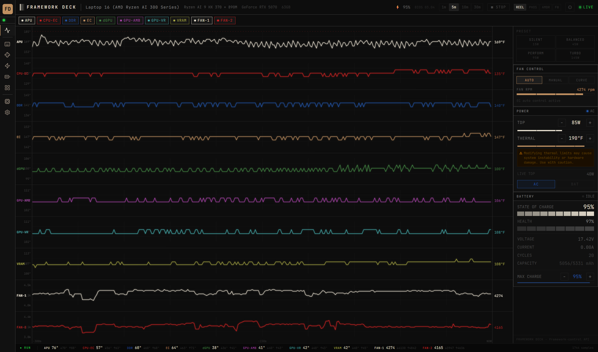
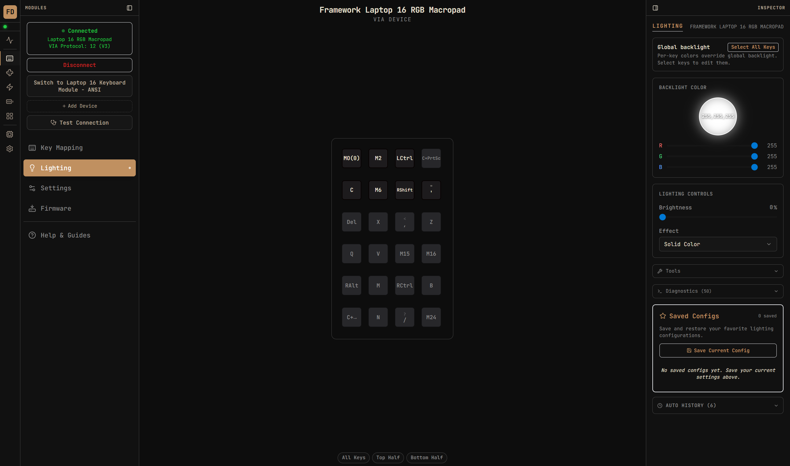
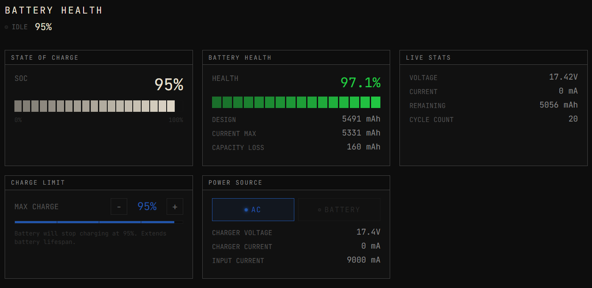
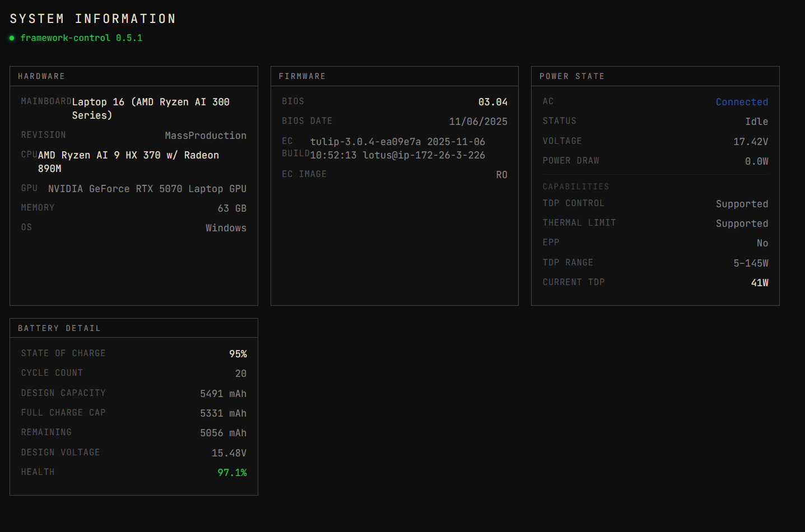
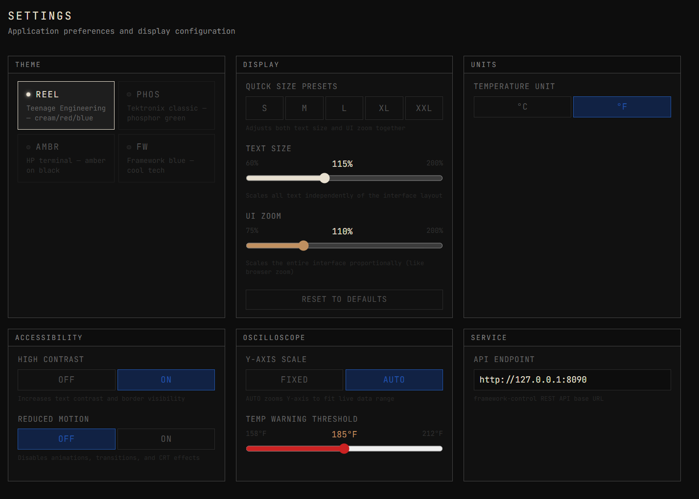

<div align="center">

# FRAMEWORK DECK

**The all-in-one desktop companion for Framework laptops.**

*Oscilloscope telemetry · Keyboard configurator · Fan control · Power management · Battery health · LED Matrix · System info — unified in one industrial-grade interface.*

[](LICENSE)
[](https://tauri.app/)
[](https://react.dev/)
[](https://www.typescriptlang.org/)
[](https://frame.work/)
[](https://developer.mozilla.org/en-US/docs/Web/API/WebHID_API)

**[⬇ Download Latest Release](https://github.com/enkode/FrameworkDeck/releases/latest)**

</div>

---


*Live oscilloscope dashboard — 10 stacked sensor channels, fan RPM, fan control, power and battery at a glance. Running on Framework Laptop 16 with AMD Ryzen AI 9 HX 370 + RTX 5070.*

---

## What is Framework Deck?

Framework Deck is a unified desktop application for Framework laptop owners who want full visibility and control over their hardware. It combines real-time telemetry visualization with the complete keyboard and input module configuration toolset — everything in one window.

**Design language:** Tektronix MSO meets Teenage Engineering. Multi-channel waveform display, stacked sensor traces, cream/red/blue palette on near-black. JetBrains Mono throughout. Minimal, precise, information-dense.

Built with Tauri 2 + React 19 + TypeScript + Tailwind CSS. Lightweight native window — not Electron, no 200 MB download.

---

## Download

> **[⬇ Latest Release](https://github.com/enkode/FrameworkDeck/releases/latest)** — Windows and Linux installers, no setup required.

| Platform | Installer | Notes |
|----------|-----------|-------|
| **Windows 11/10** | `.exe` (NSIS) | Recommended for most Windows users |
| **Windows 11/10** | `.msi` | Enterprise / managed deployments |
| **Linux** (any distro) | `.AppImage` | Universal — `chmod +x` and run, no install needed |
| **Debian / Ubuntu** | `.deb` | Native package — `sudo dpkg -i framework-deck_*.deb` |
| **Fedora / RHEL** | `.rpm` | Native package — `sudo rpm -i framework-deck-*.rpm` |

**For telemetry features** (oscilloscope, fan control, power, battery, system info): the [framework-control](https://github.com/ozturkkl/framework-control) service must be running. See [Setup](#setup).

**The keyboard configurator works standalone** via WebHID — no backend service needed.

### Linux Notes

- **AppImage** is the easiest option — make it executable and run. Works on any distro.
- **WebHID** requires Chromium-based WebView. Most distros ship `webkit2gtk-4.1` which supports this. If the keyboard configurator can't connect, ensure `webkit2gtk-4.1` is installed.
- **framework-control on Linux** uses `ectool` for hardware access. See the [framework-control Linux setup guide](https://github.com/ozturkkl/framework-control#linux).

---

## Includes Input Architect

> **Framework Input Architect** (`enkode/input-architect`) was a standalone keyboard and macropad configurator for the Framework Laptop 16. After reaching v0.15 with a full feature set, it was merged into Framework Deck as the Keyboard module. The Input Architect repository is now archived.
>
> **Everything Input Architect did, Framework Deck does** — plus live telemetry, fan control, power management, battery health, LED Matrix, and system info.
>
> If you were using Input Architect: install Framework Deck, connect your device the same way (WebHID). Your saved configs export/import as JSON.

---

## Screenshots

### Oscilloscope Dashboard
Every active sensor on its own color-coded lane, scrolling in real time. Right panel gives you fan control, TDP, thermal limit, and battery state without leaving the view.


---

### Keyboard Configurator — Key Mapping
Full VIA remapping. 6 layers, 100+ QMK keycodes, modifier combos, layer switching (MO/TG/TO). Shown here: Framework 16 RGB Macropad connected via VIA Protocol V3.


---

### Keyboard Configurator — Lighting
Global and per-key RGB. Color picker, brightness, effects, saved config snapshots, auto-history. Global mode works with stock firmware; per-key requires nucleardog firmware.



---

### Battery Health
SoC, health %, design vs. current max capacity, capacity loss in mAh, live voltage/current/cycles, configurable charge limit, power source detection.



---

### Power Management
TDP limit (5–145W), thermal limit control, live TDP readout, AC/Battery profile switching.


---

### System Information
CPU, GPU, mainboard, memory, OS. BIOS version, EC firmware build, EC image type, power state capabilities.



---

### Settings
Theme picker (4 themes), quick size presets, independent text/UI zoom sliders, units, accessibility options, oscilloscope Y-axis mode, temperature warning threshold, API endpoint.



---

### Input Modules — LED Matrix Editor
Click or drag to paint 306 individual LEDs on the Framework 16 display panel. Pattern presets: CLEAR, FILL, CHECKER, BORDER, CROSS, WAVE. Module slot inventory shows all installed hardware.


---

### Input Architect (legacy — now merged into Deck)


---

## Features

### Dashboard — Live Telemetry Oscilloscope

- Multi-channel stacked waveform display — Canvas-based, custom-drawn
- Channels auto-discovered from the `framework-control` service
- Per-channel color coding with enable/disable toggle
- Time window: 1m / 5m / 10m / 30m
- Hover cursor with exact value tooltip
- CRT scanline overlay
- Live status bar — current value of every active channel
- Pause/resume trace scrolling

### Keyboard Configurator

**Key Mapping**
- Full remapping via VIA V2 and V3 (auto-detected)
- 6 programmable layers (base + 5 custom)
- Layer switching: MO (hold), TG (toggle), TO (switch and stay)
- 100+ QMK keycodes: Letters, Numbers, F-Keys, Navigation, Editing, Symbols, Media, Modifiers, Numpad, Layers, Special
- Modifier combinations (Ctrl, Shift, Alt, Win)
- Live readback — see what's actually programmed on the device

**RGB Lighting**
- Global mode: effect, brightness, speed, color — stock firmware
- Per-key mode: individual key colors — requires nucleardog rgb_remote firmware
- Per-key brightness scaling — proportional across mixed-color selections
- Click to select, Shift+click range (cross-row), Ctrl+click multi-select
- Key group presets: Letters, Numbers, F-Keys, WASD, FPS, MOBA, Arrows, Mods
- Custom named key group presets
- Editable slider values — click the number to type exact values
- Dim key glow — very low brightness colors still show a subtle glow
- Per-key colors persist after close — stored in firmware RAM until power cycle
- Auto-restore all RGB settings on reconnect and sleep/wake

**Config Management**
- Save Current Config — EEPROM + localStorage + named snapshot in one click
- Auto-snapshots on reset and session start
- Named manual saves
- Restore any snapshot — per-key colors auto-select all keys on restore
- Full backup & restore — export/import complete config (all layers + RGB) as JSON
- Export individual snapshots as JSON

**Device Management**
- Multi-device: connect keyboard + macropad separately, switch with one click
- Auto-reconnect after sleep/wake
- VIA protocol version auto-detected

**Diagnostics**
- LED flash test (white/red/green/blue), pass/fail report, auto-troubleshooting
- Health check — HID, protocol, RGB read/write, EEPROM, per-key support
- Centralized log viewable in-app or via Tauri log file

**Firmware**
- 5-step guided flash: Select → Download → Bootloader → Flash → Reconnect
- UF2 validator: magic bytes, RP2040 family ID, flash address, block integrity
- One-click build script generator for nucleardog firmware (auto-installs QMK MSYS)
- Device-specific bootloader instructions

### Fan Control
- AUTO / MANUAL / CURVE modes
- Manual duty % slider
- Live RPM readout

### Power Management
- TDP: 5–145W in 5W steps, live TDP readout
- Thermal limit with hardware safety warning
- AC/Battery profile switching

### Battery Health
- State of charge with segmented bar
- Battery health % with visual indicator
- Design vs. current max capacity, capacity loss in mAh
- Live voltage, current, remaining capacity
- Cycle count
- Configurable charge limit

### Input Modules — LED Matrix
- 306-LED paint interface for Framework 16 LED Matrix display
- Click or drag individual LEDs
- Pattern presets: CLEAR, FILL, CHECKER, BORDER, CROSS, WAVE
- Module slot inventory

### System Information
- CPU, GPU, mainboard, memory, OS
- BIOS version and date
- EC firmware build and image
- Power state, capability matrix, TDP range, current TDP

### Settings
- 4 color themes: **REEL** (Teenage Engineering, cream/red/blue), **PHOS** (phosphor green, Tektronix), **AMBR** (HP amber terminal), **FW** (Framework blue)
- Quick size presets: S / M / L / XL / XXL
- Independent text size (60–200%) and UI zoom (75–200%)
- Temperature units: °C / °F
- High contrast mode
- Reduced motion — disables animations, transitions, CRT effects
- Oscilloscope Y-axis: FIXED or AUTO
- Temperature warning threshold
- API endpoint for non-default `framework-control` setups

---

## Hardware Support

### Telemetry (via `framework-control`)

| Hardware | Sensors Available |
|----------|------------------|
| Framework Laptop 13 (AMD / Intel) | CPU temp, fan RPM, power draw |
| Framework Laptop 16 (AMD Ryzen 7040) | APU, CPU-EC, DDR, EC, dGPU, GPU-AMB, GPU-VR, VRAM temps; dual fan RPM |
| Framework Laptop 16 (AMD Ryzen AI 300) | Same as above |

### Keyboard Configurator (WebHID)

| Module | PID | Keys | LEDs | Per-Key RGB |
|--------|-----|------|------|:-----------:|
| Framework 16 ANSI Keyboard | `0x0012` | 78 | 97 | With custom firmware |
| Framework 16 RGB Macropad | `0x0013` | 24 | 24 | With custom firmware |

---

## Firmware Options

| Firmware | Per-Key RGB | VIA | Source |
|----------|-------------|-----|--------|
| [Official Framework QMK](https://github.com/FrameworkComputer/qmk_firmware) | Global only | V3 | [FrameworkComputer/qmk_firmware](https://github.com/FrameworkComputer/qmk_firmware) |
| [nucleardog rgb_remote](https://gitlab.com/nucleardog/qmk_firmware_fw16) | Yes — host-controlled | V3 | [nucleardog/qmk_firmware_fw16](https://gitlab.com/nucleardog/qmk_firmware_fw16) |
| [tagno25 OpenRGB](https://github.com/tagno25/qmk_firmware) | Yes — via OpenRGB | No | [tagno25/qmk_firmware](https://github.com/tagno25/qmk_firmware) |
| [Shandower81 CORY](https://github.com/Shandower81/CORY-FRAMEWORK-RGB-KEYBOARD) | Baked-in per-layer | Partial | [Shandower81/CORY-FRAMEWORK-RGB-KEYBOARD](https://github.com/Shandower81/CORY-FRAMEWORK-RGB-KEYBOARD) |

### Flashing Safety

Framework 16 input modules use the **RP2040**. Its first-stage bootloader is **burned into mask ROM at the factory** — it cannot be modified. A corrupted or failed flash is caught by the ROM and the device boots into USB recovery mode (`RPI-RP2` drive).

The two-key bootloader combo is a **hardware circuit** that bypasses firmware entirely. You cannot permanently brick these modules.

---

## Setup

### 1. Install framework-control (for telemetry)

Framework Deck uses [ozturkkl/framework-control](https://github.com/ozturkkl/framework-control) — a Rust service that wraps the official `framework_tool` CLI and exposes a REST API on port 8090.

**Windows:** Follow the [framework-control Windows setup](https://github.com/ozturkkl/framework-control#windows).

**Linux:** Follow the [framework-control Linux setup](https://github.com/ozturkkl/framework-control#linux). The service uses `ectool` for EC access — you'll need to run it with appropriate permissions or set up a udev rule.

Once `framework-control` is running, Framework Deck connects automatically. If you're using a non-default port or running the service on another machine, update the endpoint in **Settings → Service → API Endpoint**.

### 2. Install Framework Deck

**Windows:** Download the `.exe` or `.msi` from [Releases](https://github.com/enkode/FrameworkDeck/releases/latest) and run it.

**Linux (AppImage):**
```bash
chmod +x Framework_Deck_*.AppImage
./Framework_Deck_*.AppImage
```

**Debian / Ubuntu:**
```bash
sudo dpkg -i framework-deck_*_amd64.deb
```

**Fedora / RHEL:**
```bash
sudo rpm -i framework-deck-*-1.x86_64.rpm
```

### 3. Connect a keyboard or macropad (optional)

Open the **Keyboard** module, click **Connect Your Device**, and select your Framework keyboard or macropad from the device picker. WebHID requires a Chromium-based WebView (shipped with Tauri on both Windows and Linux).

---

## Building from Source

### Prerequisites

- [Node.js](https://nodejs.org/) 18+
- [Rust](https://rustup.rs/) stable toolchain
- **Windows:** [Visual C++ Build Tools](https://visualstudio.microsoft.com/visual-cpp-build-tools/)
- **Linux (Debian/Ubuntu):**
  ```bash
  sudo apt install libwebkit2gtk-4.1-dev libappindicator3-dev librsvg2-dev \
    patchelf libssl-dev libgtk-3-dev libayatana-appindicator3-dev \
    libsoup-3.0-dev libjavascriptcoregtk-4.1-dev
  ```
- **Linux (Fedora):**
  ```bash
  sudo dnf install webkit2gtk4.1-devel libappindicator-gtk3-devel \
    librsvg2-devel patchelf openssl-devel gtk3-devel
  ```

### Clone

```bash
git clone --recurse-submodules https://github.com/enkode/FrameworkDeck.git
cd FrameworkDeck
```

> The `--recurse-submodules` flag is required to clone the `framework-control` backend service alongside the app. If you already cloned without it, run `git submodule update --init`.

### Dev

```bash
cd app
npm install
npm run dev          # Vite dev server (use Chrome/Edge for WebHID)
npm run tauri dev    # Full native window
```

### Build installer

```bash
cd app
npm run tauri build  # Creates installer in app/src-tauri/target/release/bundle/
```

---

## Repo Structure

```
FrameworkDeck/
├── .github/
│   ├── ISSUE_TEMPLATE/        # Bug report and feature request templates
│   ├── workflows/
│   │   └── release.yml        # Automated Windows build + GitHub Release on git tag
│   └── RELEASE_TEMPLATE.md
├── app/                       # Tauri 2 + React 19 application
│   ├── src/
│   │   ├── App.tsx            # Root — SWR wiring, channel discovery, module routing
│   │   ├── api/               # REST client for framework-control
│   │   ├── store/             # Zustand state (prefs, device state)
│   │   ├── hooks/             # SWR data-fetching hooks
│   │   ├── modules/           # Top-level module views (Dashboard, Keyboard, Battery, etc.)
│   │   ├── components/        # Reusable UI (oscilloscope, keyboard, panels, layout, nav)
│   │   ├── services/          # HIDService, ConfigService, StorageService, Logger
│   │   ├── data/              # Key definitions, firmware catalog, presets
│   │   ├── types/             # TypeScript types (VIA protocol, navigation)
│   │   ├── utils/             # Keycodes, color, UF2, formatting, font scaling
│   │   ├── config/            # Channel definitions for oscilloscope
│   │   ├── layouts/           # AppShell (NavRail + content)
│   │   └── index.css          # CSS custom properties for all 4 themes
│   └── src-tauri/             # Tauri 2 Rust shell + bundler config
├── docs/
│   └── screenshots/           # Screenshots used in this README
├── repo/
│   └── framework-control/     # Git submodule — ozturkkl/framework-control (Rust telemetry service)
├── .gitmodules                # Submodule declaration
├── CHANGELOG.md               # Full version history
├── LICENSE                    # MIT
└── README.md
```

### About the submodule (`repo/framework-control`)

`repo/framework-control` is a git submodule pointing to [ozturkkl/framework-control](https://github.com/ozturkkl/framework-control). This is the Rust backend service that Framework Deck uses for all telemetry data — temperatures, fan RPM, power draw, battery stats, system info, and hardware control.

We include it as a submodule so the full source is available alongside the frontend. Framework Deck does **not** modify this service — it consumes its REST API. All credit for `framework-control` goes to [ozturkkl](https://github.com/ozturkkl).

---

## API Reference

Framework Deck communicates with `framework-control` over HTTP on port 8090.

| Endpoint | Method | Description |
|----------|--------|-------------|
| `/api/health` | GET | Service health and version |
| `/api/thermal/history` | GET | Sensor channel data with history buffer |
| `/api/power` | GET | Current TDP, thermal limit, power draw |
| `/api/battery` | GET | SoC, health, capacity, voltage, current, cycles |
| `/api/system` | GET | Hardware info, firmware versions |
| `/api/fan` | GET | Fan RPM and current mode |
| `/api/config` | POST | Write TDP, thermal limit, fan mode, charge limit |

Authentication: Bearer token set in `app/.env.local` as `VITE_API_TOKEN`.

### WebHID — VIA Protocol

Key remapping and RGB control use VIA raw HID (usage page `0xFF60`, usage `0x61`).

**nucleardog rgb_remote extension** (per-key RGB, command prefix `0xFE`):

| Command | Description |
|---------|-------------|
| `0xFE 0x00` | Query per-key RGB support |
| `0xFE 0x01` | Enable per-key mode |
| `0xFE 0x02` | Disable per-key mode |
| `0xFE 0x10` | Set LED colors (batch, up to 10 LEDs per packet) |

---

## Development

```bash
cd app
npm run dev           # Dev server + HMR (browser mode — use Chrome/Edge)
npm run build         # Type-check + production build
npm run lint          # ESLint
npm run tauri dev     # Full desktop app
npm run tauri build   # Windows installer
```

### Adding a Theme

1. Add a `[data-theme="yourtheme"]` block in `app/src/index.css` with CSS custom property overrides
2. Add the theme ID and label to the `THEMES` array in `app/src/store/app.ts`
3. The Settings → Theme picker picks it up automatically

### Adding a Keyboard Definition

1. Create `app/src/data/definitions/yourdevice.ts` following `framework16.ts`
2. Define matrix positions, LED indices, and VIA layout JSON
3. Add the product ID to `SUPPORTED_VIDS` in `HIDService.ts`
4. Add auto-detection in `App.tsx` based on `connectedProductId`
5. Add firmware entries in `firmware-catalog.ts` if applicable

### Adding a Module

1. Create `app/src/modules/YourModule.tsx`
2. Add the module ID and icon to `NavRail.tsx`
3. Wire the route in `App.tsx`
4. Add SWR hooks in `app/src/hooks/` for any new API calls

### Keeping Docs Updated

When adding features or fixing bugs:
- Update `CHANGELOG.md` with the version, date, and description
- Update this README if any feature list, hardware support, or API info changes
- Update the roadmap table if an upcoming feature ships or a new one is planned

---

## Upcoming Features

We're actively developing Framework Deck and welcome testing across all Framework models and firmware combos. **If something doesn't work on your specific setup, open an issue — we'll iterate until it does.**

| Feature | Notes |
|---------|-------|
| **Light mode** | A LITE theme for bright environments. Yes, we hear the three of you. |
| **Floating desktop widget** | Compact always-on-top overlay with customizable graphs, temps, fan RPM, battery — without opening the full app |
| **System tray service** | Run as a background service with a notification tray icon — no taskbar entry |
| **Fan curve visual editor** | Drag-curve editor for custom fan profiles, plotted against temperature |
| **Alert thresholds** | Toast notifications when sensors exceed configurable limits (e.g. APU > 90°C) |
| **LED Matrix animations** | Animated patterns, scrolling text, reactive modes for the Framework 16 LED Matrix |
| **Rapid Trigger mode** | Analog key actuation control (requires analog switch firmware) |
| **CSV / JSON export** | Export recorded sensor history |
| **Expansion card detection** | Identify installed expansion cards |
| **Multi-device LAN discovery** | Connect to framework-control on other machines |
| **Linux support** | ectool integration path for thermal/fan on Linux |

Open an issue to request features or share feedback on any of the above.

---

## Credits

### Backend Service

- **[ozturkkl/framework-control](https://github.com/ozturkkl/framework-control)** — The Rust service providing all telemetry data. Framework Deck is built on top of this. Without it, the entire monitoring side of the app doesn't exist.

### Framework Computer

- **[FrameworkComputer/qmk_firmware](https://github.com/FrameworkComputer/qmk_firmware)** — Official QMK firmware for Framework 16 input modules
- **[FrameworkComputer/the-via-keyboards](https://github.com/FrameworkComputer/the-via-keyboards)** — VIA keyboard definitions for Framework devices
- **[FrameworkComputer/inputmodule-rs](https://github.com/FrameworkComputer/inputmodule-rs)** — Official Framework input module control library
- **[FrameworkComputer/EmbeddedController](https://github.com/FrameworkComputer/EmbeddedController)** — EC firmware source and documentation
- **[FrameworkComputer/framework_tool](https://github.com/FrameworkComputer/framework_tool)** — Official CLI utility that `framework-control` wraps

### Community Firmware

- **[nucleardog](https://gitlab.com/nucleardog/qmk_firmware_fw16)** — Custom QMK fork with `rgb_remote` per-key RGB protocol. Per-key lighting in Framework Deck would not exist without this work.
- **[tagno25](https://github.com/tagno25/qmk_firmware)** — OpenRGB per-key firmware
- **[Shandower81](https://github.com/Shandower81/CORY-FRAMEWORK-RGB-KEYBOARD)** — CORY per-layer RGB keymap

### Protocols & Tooling

- **[VIA](https://www.caniusevia.com/)** / **[the-via/keyboards](https://github.com/the-via/keyboards)** — Keyboard configuration protocol and definitions
- **[QMK Firmware](https://github.com/qmk/qmk_firmware)** — Open-source keyboard firmware powering Framework input modules
- **[QMK MSYS](https://msys.qmk.fm/)** — Windows build environment for QMK
- **[microsoft/uf2](https://github.com/microsoft/uf2)** — USB Flashing Format spec used by the RP2040 bootloader

### Community Testers

- **MJ1** — Detailed feedback on Linux builds, bricking risk accuracy, and QMK layer documentation
- **Per_Magnus_Tveten** — First macropad tester; identified layer switching as a needed feature

---

## Contributing

Issues, pull requests, and hardware testing reports are all welcome.

```bash
git clone --recurse-submodules https://github.com/enkode/FrameworkDeck.git
cd FrameworkDeck/app
npm install
git checkout -b feature/your-feature-name
# make changes
# open a pull request
```

For larger changes, open an issue first to discuss the approach.

If you have a Framework device and want to test new features or report hardware-specific behavior, that's especially valuable — Framework models and firmware variants all behave a little differently.

---

## License

MIT — see [LICENSE](LICENSE) for details.

---

<div align="center">
<sub>Not affiliated with Framework Computer Inc.</sub>
</div>
